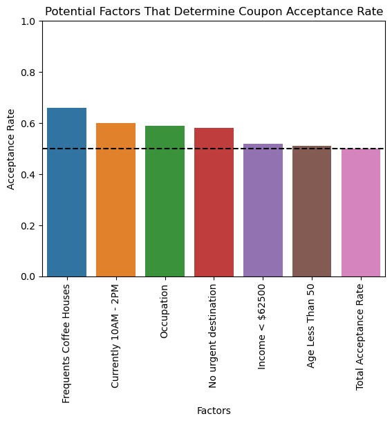

# Coupon Acceptance Analysis
## Introduction
This project is a practical application as part of the UC Berkeley AI/ML Professional Certificate course. For this project, I look through a survey dataset provided by the UCI Machine Learning Repository. This dataset describes different scenarios on whether drivers would accept a coupon for resturants or bars. Given this data, I will be looking for factors that determine whether a driver will or will not accept a coupon.

The bulk of my analysis and code are located in the notebook in this repository: https://github.com/DKW2/coupon-acceptance/blob/main/CouponAnalysis.ipynb

## Initial Data Analysis
The dataset has 12684 rows and 26 columns. Each row describes a recorded observation of a driver, while the columns have features such as "Time of Day", "Age", "Gender", "# of visits to resturants per month", etc.

In addition, the dataset is split by coupon groups. Each group of drivers was offered a coupon for a different establishment. The distribution can be seen below:

    

## Bar Coupon Group (Guided Analysis)
Within the provided notebook, I first did some analysis on the Bar coupon group, following the guided instructions to discover impactful features in the coupon group. Since this is guided, I won't delve too deep into the analysis here. One of the discoveries I made was that drivers who frequent bars more often have a higher acceptance rate. In addition, it seems like drivers that don't have a high income and frequent cheap restaurants don't accept the coupon as much, probably due to them being conservative with spending money at a bar. Lastly, it seems like drivers with non-kid passengers had higher acceptance rates. This could be because the drivers are more inclined to go to bars with their passangers rather than alone or with a child.

Overall, there are indeed factors that imply higher acceptance rates for the bar coupon group which can be explored deeper later on.

## Coffee House Coupon Group (Independent Analysis)
Once I have finished the guided analysis through the bar coupon group, I decided to do an independent investigation on the Coffee House coupon group, partly due to it having the largest amount of recorded observations.

After I filtered the dataset for records having a coffee house coupon, I ended up with 3996 rows with a total acceptance rate of 0.499. I then proceeded to look through the features of the dataset, searching for features that have a high impact on the coupon acceptance rate. Some notable features included the frequency drivers visit coffee houses as well as the time of day:

    
    

As we can see from these two visuals, there are definite values for visits (>1 times) and time (10AM and 2PM) that have a much higher acceptance rate. Besides these two features, I have also found other factors that have similar impact on whether drivers will accept a coffee house coupon. For more visuals and analysis, the notebook provides a lot more detail.

### Findings

Once I finished my analysis, I found that these are the factors that are strong indications for a high acceptance rate:
* Drivers who frequent coffee houses at least once a month
* The driver is NOT 50+ years old
* The time is in the late morning (10AM) or early afternoon (2PM)
* Income is below $62500
* The driver does not have an urgent destination to go to
* The driver is in one of these occupations:
    - Unemployed
    - Student
    - Healthcare Practitioners & Technical
    - Healthcare Support
    - Building & Grounds Cleaning & Maintenance
    - Transportation & Material Moving

Putting the individual acceptance rate for each of these factors into a barplot and then comparing them to the total acceptance rate, we can clearly see that observations with these factors improves the acceptance rate:

    

Lastly, I filtered the coffee coupon group for records with all of these factors and calculated a high 0.817 acceptance rate. Although the size of the filtered data is somewhat small, it still helps establish the fact that these factors do imply a high acceptance rate.

## Next Steps
With these potential factors of acceptance rate, we could focus our research and data collection on them to confirm our hypothesis. For example, perhaps offering more coupons to drivers that share some of these factors and recording more data. Otherwise, shops would be benefited for appealing coupons to the demographics that follow these factors.

In addition, for the dataset as a whole, there are some demographics that are not represented as much as others. For example, drivers over the age of 40 do not have as much data as younger drivers, meaning we could be losing on some insight in this demographic. Coupon groups also have differing numbers of drivers, making comparisons between them slightly inaccurate. 

Besides that, when conducting data collection next time, there should be a higher emphasis on recording numerical data rather than categorical data for features such as age, income, temperature, and time. While categorical data is very easy to input and collect, numerical data gives a lot more insight and deeper analysis on the dataset as a whole.
